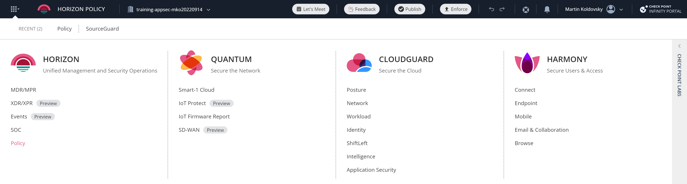
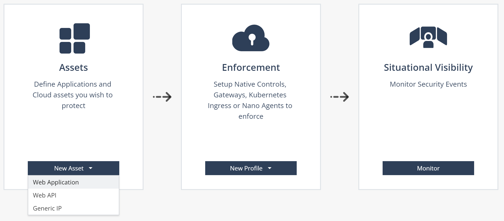
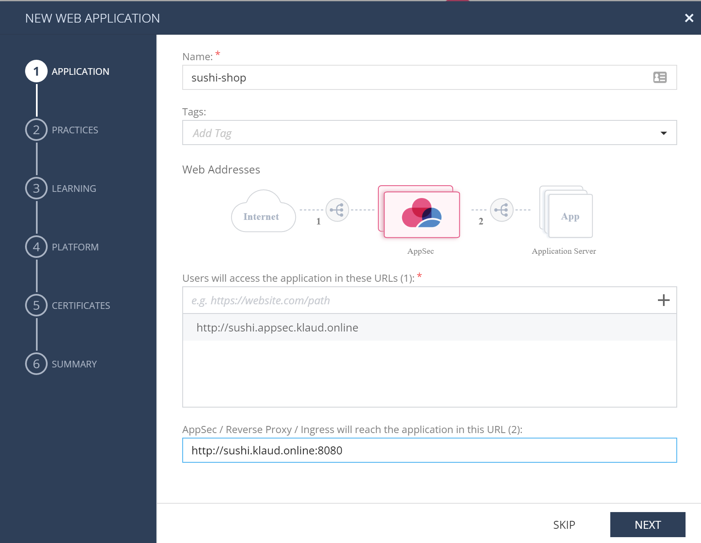
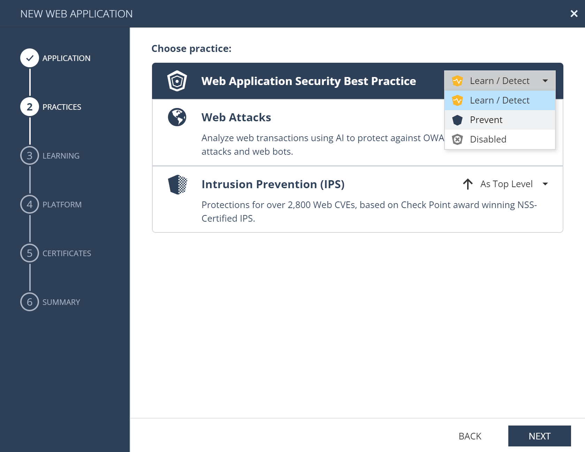

# CloudGuard AppSec on Azure - Training 11/2022

## AppSec
Check Point CloudGuad AppSec is low administration overhead, automated *application security and API protection* (aka WAAP) powered by contextual AI. AppSec stops attacks against your web applications with a fully automated, cloud native application security solution.

* AppSec [homepage](https://www.checkpoint.com/cloudguard/appsec/) with very useful video introductions
* product [documentation](https://appsec-doc.inext.checkpoint.com/)
* AppSec [product deployment](https://azuremarketplace.microsoft.com/en/marketplace/apps/checkpoint.checkpoint_waap?tab=Overview) on Azure Marketplace

## Training lab goal

We are going to deploy CloudGuard AppSec gateways based on GaiaOS VM into Azure public cloud to protect aplications to be published to Internet users.

Applications to protect:
* e-shop website at [http://sushi.klaud.online:8080/](http://sushi.klaud.online:8080/)
* small web app security educational project DSVW at [http://dsvw.klaud.online:1234/](http://dsvw.klaud.online:1234/)

Once we are finished applications will be protected using AppSec accessible from your machine using following URLs.
* e-shop: [http://sushi.appsec.klaud.online](http://sushi.appsec.klaud.online)
* DSVW: [http://exploit.appsec.klaud.online](http://exploit.appsec.klaud.online)

These URLs will be implemented on your machine using modification of hosts file - pointing to IP address of deployed CloudGuard AppSec VM on Azure cloud.

You will be also provided with valid certificates for these hostnames issued using Let's Encrypt CA.

Certificates (download and save for later):
* [cert-appsec-sushi.pf](https://github.com/mkol5222/appsec-training/blob/main/assets/training-only-certificates/cert-appsec-sushi.pfx?raw=true)
* [cert-appsec-exploit.pfx](https://github.com/mkol5222/appsec-training/blob/main/assets/training-only-certificates/cert-appsec-exploit.pfx?raw=true)

## Prerequisites

### Infinity Portal tenant
CloudGuard AppSec is managed using Check Point cloud management that is part of [Infinity Portal](https://portal.checkpoint.com/) accessed at [https://portal.checkpoint.com/](https://portal.checkpoint.com/).

You may already have user access to *Infinity Portal*. We highly recommend to keep training experiments separate in **dedicated tenant**.

New tenant is created using account creation request [link](https://portal.checkpoint.com/create-account) and can be associate to your already existing user (person).

Account Name is significant information field to identify your tenant. For visibility in Check Point's sales system use Account Name format **training-appsec-<your-unique-string>** e.g. *training-appsec-mko20221120*
In case you already have Infinity Portal user, do not worry and tenter your data into registration form - new tenant will be visible to your existing user access.

### Azure Portal subscription
CloudGuard AppSec is deployed as Virtual Machine into Azure public cloud. You may use your existing Azure subscription or create dedicated Azure Free Tier subscription ([registration](https://azure.microsoft.com/en-us/free/)).

## AppSec Management Portal

[Infinity Portal](https://portal.checkpoint.com/) enables management of wide variety of Check Point solutions. AppSec resides in CloudGuard pilar (under Application Security entry) or can be accessed from Horizon column ()

### Getting started

CloudGuard AppSec protected applications are called **ASSETS**. Assets map front-end URLs (how your users access application from browser) to backed server (real location of your app) and associate it with security policy, logging and additional settings.

Assets are enforced by **AGENTS** deployed in various deployment options (e.g. GaiaOS VM, Kubernetes Ingress, NGINX integration on Linux OS). Agents are installed according to **PROFILE**. Profile is also where we get authentication token to install agent and register it under our management tenant. Authentication token is sensitive credential, so handle it as such.

### Protecting e-shop with new *Web Application Asset*

Lets start in [Getting Started section](https://portal.checkpoint.com/dashboard/policy#/cloud/getting-started) with New Asset / Web Application.

#### Step 1: map front-end URL to backend server

Name our app: sushi-shop

Map access URL: http://sushi.appsec.klaud.online

Note that we start with HTTP and hostname must match our provided valid certificate once we switch to HTTPS in future. Plus sign (+) adds your URL to the list.

Map to backend sever: http://sushi.klaud.online:8080

#### Step 2: Choose security engines to operate in PREVENT

While in real world we would start with Learn/Detect mode of operation, we are fine choosing *PREVENT* for lab and demonstration.

Notice that screen highlights both AI-based engine and parallel Check Point IPS engine with almost 3k of web and web API related signatures.

#### Step 3:

## Summary
