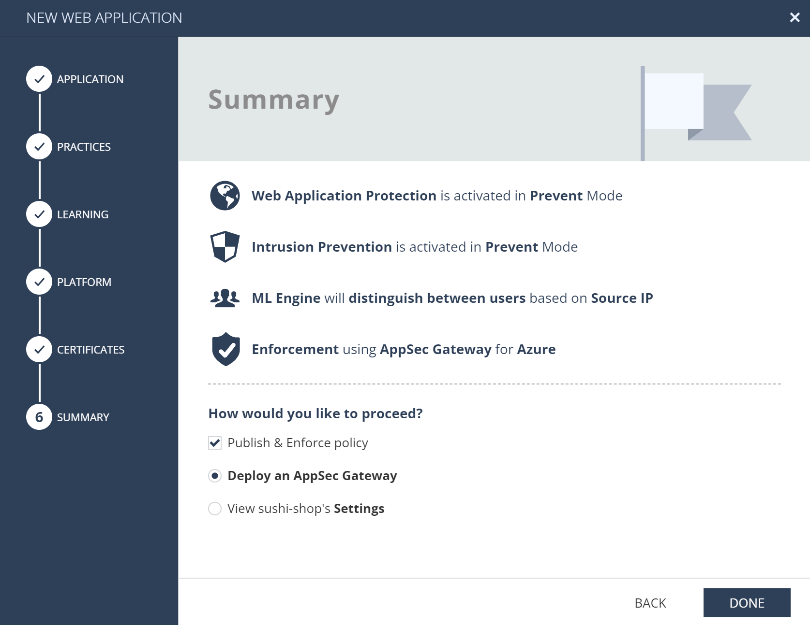

# CloudGuard AppSec on Azure - Training 11/2022

## AppSec
Check Point CloudGuad AppSec is low administration overhead, automated *application security and API protection* (aka WAAP) powered by contextual AI. AppSec stops attacks against your web applications with a fully automated, cloud native application security solution.

* AppSec [homepage](https://www.checkpoint.com/cloudguard/appsec/) with very useful video introductions
* product [documentation](https://appsec-doc.inext.checkpoint.com/)
* AppSec [product deployment](https://azuremarketplace.microsoft.com/en/marketplace/apps/checkpoint.checkpoint_waap?tab=Overview) on Azure Marketplace

## Training lab goal

We are going to deploy CloudGuard AppSec gateways based on GaiaOS VM into Azure public cloud to protect aplications to be published to Internet users.

Applications to protect:
* e-shop website at [http://sushi.klaud.online:8080/](http://sushi.klaud.online:8080/)
* small web app security educational project DSVW at [http://dsvw.klaud.online:1234/](http://dsvw.klaud.online:1234/)

Once we are finished applications will be protected using AppSec accessible from your machine using following URLs.
* e-shop: [http://sushi.appsec.klaud.online](http://sushi.appsec.klaud.online)
* DSVW: [http://exploit.appsec.klaud.online](http://exploit.appsec.klaud.online)

These URLs will be implemented on your machine using modification of hosts file - pointing to IP address of deployed CloudGuard AppSec VM on Azure cloud.

You will be also provided with valid certificates for these hostnames issued using Let's Encrypt CA.

Certificates (download and save for later):
* [cert-appsec-sushi.pf](https://github.com/mkol5222/appsec-training/blob/main/assets/training-only-certificates/cert-appsec-sushi.pfx?raw=true)
* [cert-appsec-exploit.pfx](https://github.com/mkol5222/appsec-training/blob/main/assets/training-only-certificates/cert-appsec-exploit.pfx?raw=true)

## Prerequisites

### Infinity Portal tenant
CloudGuard AppSec is managed using Check Point cloud management that is part of [Infinity Portal](https://portal.checkpoint.com/) accessed at [https://portal.checkpoint.com/](https://portal.checkpoint.com/).

You may already have user access to *Infinity Portal*. We highly recommend to keep training experiments separate in **dedicated tenant**.

New tenant is created using account creation request [link](https://portal.checkpoint.com/create-account) and can be associate to your already existing user (person).

Account Name is significant information field to identify your tenant. For visibility in Check Point's sales system use Account Name format **training-appsec-<your-unique-string>** e.g. *training-appsec-mko20221120*
In case you already have Infinity Portal user, do not worry and tenter your data into registration form - new tenant will be visible to your existing user access.

### Azure Portal subscription
CloudGuard AppSec is deployed as Virtual Machine into Azure public cloud. You may use your existing Azure subscription or create dedicated Azure Free Tier subscription ([registration](https://azure.microsoft.com/en-us/free/)).

## AppSec Management Portal

[Infinity Portal](https://portal.checkpoint.com/) enables management of wide variety of Check Point solutions. AppSec resides in CloudGuard pilar (under Application Security entry) or can be accessed from Horizon column ()


### Getting started

CloudGuard AppSec protected applications are called **ASSETS**. Assets map front-end URLs (how your users access application from browser) to backed server (real location of your app) and associate it with security policy, logging and additional settings.

Assets are enforced by **AGENTS** deployed in various deployment options (e.g. GaiaOS VM, Kubernetes Ingress, NGINX integration on Linux OS). Agents are installed according to **PROFILE**. Profile is also where we get authentication token to install agent and register it under our management tenant. Authentication token is sensitive credential, so handle it as such.

### Protecting e-shop with new *Web Application Asset*

Lets start in [Getting Started section](https://portal.checkpoint.com/dashboard/policy#/cloud/getting-started) with New Asset / Web Application.


#### Step 1: map front-end URL to backend server

Name our app: sushi-shop

Map access URL: http://sushi.appsec.klaud.online

Note that we start with HTTP and hostname must match our provided valid certificate once we switch to HTTPS in future. Plus sign (+) adds your URL to the list.

Map to backend sever: http://sushi.klaud.online:8080


#### Step 2: Choose security engines to operate in PREVENT

While in real world we would start with Learn/Detect mode of operation, we are fine choosing *PREVENT* for lab and demonstration.

Notice that screen highlights both AI-based engine and parallel Check Point IPS engine with almost 3k of web and web API related signatures.


#### Step 3: Learning engine - indicators

You may specify indicators that are unlikely to be malicious to improve Learning Engine verdicts.
Source IP address is determined from TCP connection source or from X-Forwarded-For header behind load-balancer or other proxy.

We choose *Source IP address* as there us direct access to Azure VM public IP address and AppSec will learn real source IP from TCP connection.


#### Step 4: Enforcement point - Agent

We do not have any agent enforcing our protections and providing access (reverse proxy) to our application.
We choose *New Profile* and *VM* on *Azure*.

More details come later. Authentication token of our new agent profile will be most significant information provided later.


#### Step 5: Certificates

Certificates come later - once we switch front-end (access) URLs to HTTPS. Clouds provide services to handle certificates like *Azure Key Vault* or in small scale certificates may be placed on gateway filesystem (/etc/certs folder). Lets keep this for later.


#### Step 6: Summary

We have defined all necessary inputs. Clicking DONE button will publish policy and make it ready for enforcement.

However there is no enforcement (agent) running yet. We will proceed with Agent installation in form-factor of GaiaOS based gateway running as Azure Virtual Machine.




#### Step 7: Agent Profile

We have moved to AppSec Gateways deployment agent profile. Notice *Environment* has *Azure* pre-selected for you and 3rd column of screen contains detailed installation instructions in Azure Portal.

Most significant information are:
* Authentication / Token - you will copy it to Azure Portal in few minutes
* CloudGuard AppSec on Azure [marketplace link](https://azuremarketplace.microsoft.com/en/marketplace/apps/checkpoint.checkpoint_waap?tab=Overview)


### Step 8: Azure Portal - AppSec single gateway deployment

We continue in [Azure Portal](https://azuremarketplace.microsoft.com/en/marketplace/apps/checkpoint.checkpoint_waap?tab=Overview) to deploy our new CloudGuard AppSec Virtual Machine.

You may also start from Azure Home / Create a resource / search "CloudGuard AppSec" to reach [single gateway deployment](https://portal.azure.com/#create/checkpoint.checkpoint_waapinfinity-gw) screen. 

We choose Resource Group. Resource groups are used to organize assets in Azure and allow you to have multiple objects of same name in different groups or make bulk operations easy including delete of all resources in one group at once.

Choose region close to you - e.g. *West Europe*

VM Name: *azuregw*

Allow access from: *0.0.0.0/0* allows AppSec gw access from all Internet. It is enforced by Azure security groups (firewall rules) applied to our VM during deployment.

GaiaOS first user is always *admin*

We highly recommend to *prefer SSH keys for VM terminal access*, because passwords are registered in deployment and might leak. SSH public keys are public by design, so providing them does not make any harm.

You may copy your existing SSH key (public part).

Copy Authentication Token (aka Infinity Next Agent Token) from your new agent profile in Infinity Portal.
***Always hit Enforce*** in Infinity Portal to activate token before using for VM deployment on Azure.


### Step 9: Azure Portal - VM size and Public IP address

Default *Standard DS2 v2* is optimal VM size for our lab.

Also ask to *Assign public IP address to the gateway* - this is how our users reach reverse proxy publishing and protecting our applications.


### Step 10: Azure Portal - Network Settings

We are fine with placing AppSec to new dedicated VNET (Virtual Network).

Also default address ranges for subnets are fine in our case as we will access AppSec using Public IP address and do not need to prevent overlaps with other potential resources in our Azure or in other private networks.


### Step 11: Azure Portal - Review and create

Lets review deployment and hit *CREATE* button to get it started.

Deployment consists from Virtual Machine (which takes longest time to be created), but also many additional network and configuration components.

Monitor deployment progress until all resources are successfully created.


Once deployment is done, you may navigate to list of [Virtual Machines](https://portal.azure.com/#view/HubsExtension/BrowseResource/resourceType/Microsoft.Compute%2FVirtualMachines) and find details of AppSec VM there.


### Step 12: Azure Portal - AppSec Virtual Machine details

Get familiar with all aspects of new AppSec VM.
Most important with *Public IP address*


### Step 13: Access URLs resolution to AppSec VM public IP

In case you are on Windows: Open PowerShell terminal window and ask for notepad to open with admin permission, so we create `hosts` file entry for our front-end (access) hostnames - pointing to IP address or our AppSec VM in Azure.

Run in PowerShell
```
Start-Process -Verb runas notepad.exe -ArgumentList $env:WINDIR\system32\drivers\etc\hosts
```

Add following line to `hosts` file and save.
Make sure to replace `13.69.55.75` with real public IP address of your AppSec GW.
```
13.69.55.75 sushi.appsec.klaud.online exploit.appsec.klaud.online
```

Running `ping sushi.appsec.klaud.online` in PowerShell should confirm host resolution to expected IP address:
```
PS C:\Users\mkoldov> ping sushi.appsec.klaud.online

Pinging sushi.appsec.klaud.online [13.69.55.75] with 32 bytes of data:
...
```

### Step 14: Infinity Portal - AppSec Web Application Asset review

Be patient until AppSec VM is deployed and AppSec nano agent installation into it is finished.

Once it is done, Agents section should confirm AppSec agent registration:


And enforced asset should be green in Asset section with Reverse Proxy details including backend server connectivity info:


Time to test access to your application from browser:
[http://sushi.appsec.klaud.online/](http://sushi.appsec.klaud.online/)

You may also try "fake" SQL Injection to see if incident is reported.
[http://sushi.appsec.klaud.online/?q=UNION+1=1](http://sushi.appsec.klaud.online/?q=UNION+1=1)


### Step 15: Upgrade to HTTPS

Before we change our front-end URL to HTTPS protocol, AppSec needs valid certificate to be present.

AppSec is obtaining certificates from:
* specialized cloud services like *Azure Key Vault*
* or from gateway filesystem (/etc/certs) which might be tricky for gateways in auto-scaling VMSS

Certificates (download):
* [cert-appsec-sushi.pf](https://github.com/mkol5222/appsec-training/blob/main/assets/training-only-certificates/cert-appsec-sushi.pfx?raw=true)
* [cert-appsec-exploit.pfx](https://github.com/mkol5222/appsec-training/blob/main/assets/training-only-certificates/cert-appsec-exploit.pfx?raw=true)

#### Step 15a: HTTPS with Azure Key Vault


#### Step 15b: HTTPS with certificates in filesystem

Connect to AppSec gateway using `ssh admin@sushi.appsec.klaud.online`

We assume that you have provided your default public SSH key from home folder's .ssh subfolder when creating VM.
Or SSH using other private SSH key with `ssh -i path-to-your-other-private-ssh-key admin@sushi.appsec.klaud.online`

Continue on AppSec gateway command-line. 
We will grab certificates from server using CURL
```
curl -k -L -o cert-appsec-sushi.pfx https://github.com/mkol5222/appsec-training/blob/main/assets/training-only-certificates/cert-appsec-sushi.pfx?raw=true
```

Now we got `cert-appsec-sushi.pfx` in current working directory.

However AppSec is expecting KEY file with server's key and PEM file with certificate. This is where `openssl` will help.

```
for C in $(ls *pfx); do echo $C; B="${C%.*}"; openssl pkcs12 -in "$B.pfx" -out "$B.key" -nocerts -nodes -passin pass:""; openssl pkcs12 -passin pass:"" -in "$B.pfx" -out "$B.pem" -nokeys -clcerts; echo ; ls "$B"*; done
```

Lets copy to `/etc/certs`
```
cp cert-appsec-sushi.{pem,key} /etc/certs/;
ls /etc/certs/
```

This is how to inspect the certificate:
```
openssl x509 -in /etc/certs/cert-appsec-sushi.pem  -noout -text
```

So you know who issued certificate, validity period and DNS name in SAN:
```
Issuer: C = US, O = Let's Encrypt, CN = R3

        Validity
            Not Before: Nov 18 11:33:41 2022 GMT
            Not After : Feb 16 11:33:40 2023 GMT

        Subject: CN = sushi.appsec.klaud.online
                DNS:sushi.appsec.klaud.online
```

#### Step 16: Enabling HTTPS on web application asset

Once certificates are in place, it is possible to switch Web Application Asset to use HTTPS:

Edit front-end access URL and upgrade it from HTTP to HTTPS:


You may visit asset's Reverse Proxy / Advanced... dialog to enable redirect from HTTP to HTTPS:


Publish and **ENFORCE** new policy.

Retry once agent has received policy and reconfigured reverse proxy for HTTPS:
[https://sushi.appsec.klaud.online/](https://sushi.appsec.klaud.online/)

Notice Asset is now listing acquired certificates:


## DSVW

Practice by publishing [http://dsvw.klaud.online:1234/](http://dsvw.klaud.online:1234/) behind your existing AppSec Gateway as [http://exploit.appsec.klaud.online/](http://exploit.appsec.klaud.online/)


Choose existing Profile for Asset enforcement:


Test and add HTTPS as second step.


Remember to introduce certificates via Azure Key Vault or in VM filesystem before upgrading asset to HTTPS access.


## Logging

Only incidents are logged by default.

Logging is controlled by **TRIGGERS**
You may define more detailed logging with more information, logging of legitimate traffice and also forward your logs to SIEM via syslog agents of your SIEM tool.


Trigger has to be changed on Asset level in Threat Prevention tab:


Threat Prevention view provides top level summary of policies assigned to assets including log level:


## Exception

First lets create "fake" SQL Injection incident to be logged by visiting [https://sushi.appsec.klaud.online/?demo=UNION+1=1](https://sushi.appsec.klaud.online/?demo=UNION+1=1)

Visit Infinity Portal / Horizon Policy / Monitor to review incident logs under [Important Events](https://portal.checkpoint.com/dashboard/policy#/operation/high-and-critical/)

Find relevant incident and double-click for detailed view:


Right click of specific incident log line allows to start Exception editor


Delete source IP address condition and define Exception as


**ENFORCE** policy and wait for agent to fetch new policy version. You may check Agents menu for policy version number.

Retry incident link:
[https://sushi.appsec.klaud.online/?demo=UNION+1=1](https://sushi.appsec.klaud.online/?demo=UNION+1=1)

Access is now allowed, because there is Exclusion for parameter named demo. Edit URL end retry for not excluded URL parameter name:
[https://sushi.appsec.klaud.online/?q=UNION+1=1](https://sushi.appsec.klaud.online/?q=UNION+1=1)

Access is blocked and incident visible in management logs under Monitor.

## Summary
