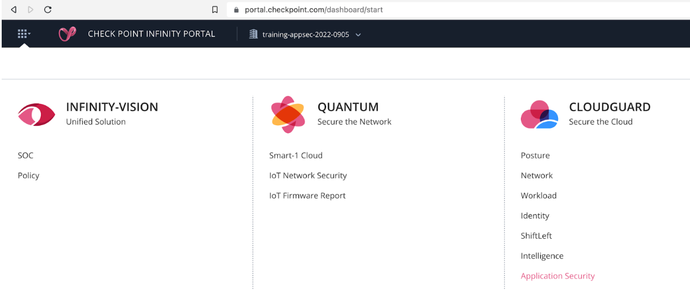
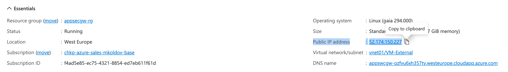

# AppSec on Azure - Training 9/2022

## Resources
* AppSec documentation [link](https://appsec-doc.inext.checkpoint.com/)
* AppSec homepage with useful videos and materials [link](https://www.checkpoint.com/cloudguard/appsec/)
* AppSec demo on TechPoint [link](https://sc1.checkpoint.com/documents/Sales_tools/DemoPoint/CloudGuard_AppSec/Topics/Introduction.htm)
* Open AppSec - community version [link](https://www.openappsec.io/)

## Prerequisites

* **Azure Portal subscription** (consider opening [Free Tier](https://azure.microsoft.com/en-us/pricing/free-services/) for edu purposes)
* **Infinity Portal tenant** with active AppSec application (free [registration](https://portal.checkpoint.com/create-account))


---
## Lab 1: Azure Portal access

* get your Azure subscription credentials (e.g. Azure free-tier)
* access [Azure Portal](https://portal.azure.com)
    * Azure [cloud shell](https://portal.azure.com/#cloudshell/) is DevOps station with necessary tools and persistent storage, your Linux workstation on-demand


### Summary:
* you have verified your valid Azure subscription credentials that enable you to deploy Check Point CloudGuard products and other Virtual Machines including complex network environments
* we will also later use Azure cloud shell for administrative tasks

### Next step:
* open AppSec management in Infinity Portal

---
## Lab 2: AppSec Gateway on Check Point Infinity Portal

* create your new free Infinity Portal tenant using tenant [creation form](https://portal.checkpoint.com/create-account)
* you may register with your existing user name (e-mail), but with unique Company name
    * Company name is your tenant identifier and it can be owner by your existing Infinity Portal user (more users could be invited to tenant later)
    * consider to prefix Company name with *training-appsec-* in case you are opening new tenant for this training session
* once you log in and select your new tenant name in portal title bar, choose **Application Security** application in CloudGuard pilar and confirm AppSec management application creation

    

* once new tenant is provisioned for you - Cloud / [Getting Started](https://portal.checkpoint.com/dashboard/policy#/cloud/getting-started) section is best place to start our further journey

    

### Summary:
* we have verified access to both Azure and Infinity Portal with brand new AppSec management application

### Next step:
* we will define simple web application (Asset) and deploy AppSec Gateway (Agent) to Azure

---
## Lab 3: Getting started with AppSec on Azure in Infinity Portal

* we are back in Cloud / [Getting Started](https://portal.checkpoint.com/dashboard/policy#/cloud/getting-started) section to create our first Asset (web application) definition and deploy it on new Enforcement - Cloud Guard AppSec virtual machine on Azure

* under *Assets* choose *New Asset* to define **Web Application** asset

    

* APPLICATION: name asset object **ip-iol**
* define front-end URL (1): **http://ip.iol.cz***
    * we will later point browser on your machine to this application using *hosts* file modification
* define back-end URL (2): **http://194.228.41.73**
    * we are using HTTP first
        * we will discuss HTTPS and handling necessary certificates later
    * we have previously found IP address of application web server by DNS query

        ```
        dig ip.iol.cz | grep ^ip.iol.cz
        ip.iol.cz.		10778	IN	A	194.228.41.73
        ```

* PRACTICES: change from Detect/Learn to **Prevent**
    

* LEARNING: keep default, but change to identification by **Source IP address**


* PLATFORM: **New Profile / VM / Azure**


* CERTIFICATES: **Next**

* SUMMARY: 
    * keep default **Deploy AppSec Gateway**
    * **Done**


* new *Agent Profile* for Azure VM deployment was opened for you
    * keep defaults, but choose SSL Certificates to be stored **in AppSec Gateway local storage**
    
    

    * make sure to press **Enforce** button and install policy before continuing
        * this will make profile and Authentication Token active *before AppSec Gateway VM deployment*

    

### Summary:
* you have created simple web application Asset
    * asset is mapping access via front-end URL to backend server with application
    * and it selects security practices to be applied in detect/prevent mode
* you have activated new Profile to install AppSec Agent as virtual machine Gateway appliance in Azure
    * profile is identified by Authentication Token that allows to provision Agent, fetch policy and upload logs
    * we will use it in next step to create VM in Azure

### Next step:
* deploy AppSec Gateway virtual machine in Azure cloud

---
## Lab 4: Deploying AppSec Gateway to Azure Cloud

* 3rd column in Profile screen - Download & Deployment contains [link](https://azuremarketplace.microsoft.com/en-us/marketplace/apps/checkpoint.checkpoint_waap?tab=Overview) to Azure MarketPlace to start AppSec virtual machine installation
* so **Get it now**
    * you might be requested to enter e-mail address

    

* Continue with **CloudGuard AppSec Single Gateway**
    * and hit **Create**

    

* in *Create CloudGuard Appsec* form:
    * create new Resource Group **appsecgw-rg**
    * Region **West Europe**
    * VM Name **appsecgw**
    * Allow access from **0.0.0.0/0**
    
    

    * Authentication type **SSH Public Key**
        * always prefer SSH keys fro cloud VMs
        * use existing SSH key - see below on SSH keys in Azure [cloud shell](https://portal.azure.com/#cloudshell/) - **paste content of ~/.ssh/appsecgw.pub**

    
    
    * this is how I have created 
        ```
        martin [ ~ ]$ cd; mkdir .ssh;  ssh-keygen -f ~/.ssh/appsecgw
        Generating public/private rsa key pair.
        Enter passphrase (empty for no passphrase): 
        Enter same passphrase again: 
        Your identification has been saved in /home/martin/.ssh/appsecgw
        Your public key has been saved in /home/martin/.ssh/appsecgw.pub
        The key fingerprint is:
        SHA256:XXxwICOBwrQ4UdNDYbq7ijvGWT6F5dqiNun0/JW4WOs martin@cc-99c25c64-7fbc45477f-fmv6p
        The key's randomart image is:
        +---[RSA 3072]----+
        |  .++o+oo.o o..  |
        |   oo=+  . + o   |
        |  o o. .    o .  |
        |   . o   . . .   |
        |    =   S .      |
        |   o +. .        |
        |..= =o o         |
        |oOo=oo+          |
        |*=+=*E           |
        +----[SHA256]-----+

        martin [ ~ ]$ cat ~/.ssh/appsecgw.pub
        (your key here)...
        ```

    * copy Authentication Token (aka Infinity Next Agent Token) from agent Profile screen in Infinity Portal we have visited earlier
        * From
        
        * to
        

    * VM Settings - keep defaults
        

    * Network Settings - defaults
        

    * Review and **create**

    * Deployment will start. AppSec VM deployment will take 5-10 minutes.

    * Once finished: Go to Resource Group 
    * Select Virtual Machine *appsecgw*
        * Once finished you may visit Virtual Machine (*appsecgw*) object and review **Public IP** and **DNS Name**

        
    
    * `.ssh/config` might be created/updated for easy SSH access to AppSec VMs

        ```
        Host appsecgw
            Hostname 52.174.150.227
            User admin
            IdentityFile ~/.ssh/appsecgw
        ```
        * so you may simply type `ssh appsecgw` or `scp file.ext appsecgw:.` later

### Summary:
* we have deployed AppSec Gateway virtual machine to Azure cloud
* we know AppSec VM IP address and DNS name
* SSH access is much easier with SSH key authentication and .ssh/config defined

### Next step:
* access simple application via AppSec Gateway reverse proxy with security enforcement

---
## Lab 5: Access web application through AppSec Gateway

* use your web browser to access application directly first
    * links are http://ip.iol.cz or http://194.228.41.73
    * web app will tell you your public IP address

* our *ip-iol* Asset configuration already defines reverse proxy mapping http://ip.iol.cz requests to real application's server http://194.228.41.73
    * in real world DNS for ip.iol.cz might be updated from real server to reverse proxy publishing application in secure way
    * we will start small - by changing your workstation *hosts* file

* on Windows - edit c:\windows\system32\drivers\etc as Administrator and add line
    ```
    52.174.150.227 ip.iol.cz
    ```

    * on Linux/macOS you would use `sudo vi /etc/hosts`
    * where 52.174.150.227 is real IP address of your AppSec VM
    * now `ping ip.iol.cz` on your workstation now should tell this IP address

* open browser and visit http://ip.iol.cz
    * web page accessed via AppSec reverse proxy should report **proxy IP address** now (e.g. 52.174.150.227 in my case - AppSec VM public IP address)

* lets pretend fake SQL Injection attack by visiting extended URL address http://ip.iol.cz/?=UNION+1=1 with pattern common for SQL injections

    * page should not load in Prevent mode and Monitoring section of Infinity Portal confirms SQL Injection attempt prevented:

    

### Summary:
* we are able to access application via AppSec reverse proxy with security enforcement
* security enforcement action is confirmed in AppSec logs using simulated SQL Injection attack

### Next step:
* lets have more detailed look at AppSec Gateway building blocks

---
## Lab 6: Inside Azure AppSec Gateway virtual machine

*  open Azure [cloud shell](https://portal.azure.com/#cloudshell/) 
* `ssh appsecgw`

* AppSec Gateway is inviting us to check AppSec Agent status using `cpnano -s`

    * it confirms Agent is running and connected to management (fog)
    * you may confirm that policy is up to date and matching *policy version* just published and enforced on management web UI 
    * it confirms list and status of installed *agent services*

    

* management side view of [agents](https://portal.checkpoint.com/dashboard/policy#/cloud/agents/?tab=general) and enforced policy
    * notice agent's *IP*, *policy version* and *SW version* reported
    * one profile with its Authentication Token can be used to install one or more agents

    

* back at AppSec Gateway VM prompt
    * VM is based on Gaia OS (Linux)
        ```
        [Expert@appswcgw:0]# clish -c 'show version all'
        Product version Check Point Gaia R80.40
        OS build 294
        OS kernel version 3.10.0-957.21.3cpx86_64
        OS edition 64-bit
        ```
    * Docker is used to run NGINX reverse proxy fully managed by Check Point
        * notice name of container: *cp_nginx_gaia*
        ```
        [Expert@appswcgw:0]# docker ps
        CONTAINER ID        IMAGE               COMMAND                  CREATED             STATUS              PORTS               NAMES
        78873a4b4845        cp_nginx_gaia       "/usr/bin/entrypoi..."   30 minutes ago      Up 30 minutes                           cp_nginx_gaia
        ```
    * you may interact with `nginx` command inside container - e.g. verify and dump whole NGINX configuration as configured by Check Point (specifically Reverse Proxy Manager module of AppSec Nano Agent)
        ```
        [Expert@appswcgw:0]# docker exec -it cp_nginx_gaia nginx -T
        nginx: the configuration file /etc/nginx/nginx.conf syntax is ok
        nginx: configuration file /etc/nginx/nginx.conf test is successful
        # configuration file /etc/nginx/nginx.conf:
        load_module /usr/lib/nginx/modules/ngx_cp_attachment_module.so;

        user nginx;

        # Set number of worker processes automatically based on number of CPU cores.
        worker_processes auto;
        ...
        ```
    * notice nginx is responsible to handle HTTP requests coming on port tcp/80
        * once we configure also HTTPS front-ends nginx will listen also on tcp/443 
        ```
        [Expert@appswcgw:0]# netstat -nap | grep LISTEN | egrep '80|443'
        tcp        0      0 0.0.0.0:30443               0.0.0.0:*                   LISTEN      7815/httpd2         
        tcp        0      0 0.0.0.0:80                  0.0.0.0:*                   LISTEN      3406/nginx: master 
        ```
    *  AppSec [documentation](https://appsec-doc.inext.checkpoint.com/concepts/gateways-and-agents) is covering agent architecture and integration with NGINX proxy using *attachment* module

### Summary:
* we have uncovered AppSec Gateway building blocks
    * AppSec Nano Agent with multiple modules responsible for policy enforcement
    * NGINX reverse proxy fully managed by AppSec and run in Docker container
* we know how to use AppSec agent command line *cpnano* for status monitoring and *nginx* command inside container to dump proxy configuration

### Next step:
* HTTPS should be default, lets have a look how to get server certificate and enable HTTPS front-end access
---

## Lab 7: Server DNS name, Certificate and HTTPS front-end access

* Azure section with [Virtual Machines](https://portal.azure.com/#view/HubsExtension/BrowseResource/resourceType/Microsoft.Compute%2FVirtualMachines)
* visiting AppSec Gateway Azure virtual machine *appsecgw*, we can see that:
    * DNS name was assigned to VM during AppSec deployment
        * note your unique DNS name - similar to *appswcgw-ozfvu6xh357ty.westeurope.cloudapp.azure.com*

        

* back in Azure [cloud shell](https://portal.azure.com/#cloudshell/) we will generate self-signed certificate for this DNS name
    ```
    # back to HOME folder
    martin [ ~ ]$ cd

    # store DNS name for our certificate CN and alternative Subject into variable
    martin [ ~ ]$ APPSECAPP=appswcgw-ozfvu6xh357ty.westeurope.cloudapp.azure.com


    # generate new self-signed certificate
    martin [ ~ ]$ openssl req -newkey rsa:2048 -nodes -keyout app.key -x509 -days 365 -addext "subjectAltName = DNS:${APPSECAPP}" -subj "/C=US/CN=${APPSECAPP}" -out app.pem
    Generating a RSA private key
    ........................................................................................................+++++
    .........................+++++
    writing new private key to 'app.key'
    -----

    # now we have key in app.key and certificate in app.pem as expected by AppSec

    # inspect certificate
    martin [ ~ ]$ openssl x509 -text -noout -in app.pem | egrep 'DNS|CN'
            Issuer: C = US, CN = appswcgw-ozfvu6xh357ty.westeurope.cloudapp.azure.com
            Subject: C = US, CN = appswcgw-ozfvu6xh357ty.westeurope.cloudapp.azure.com
                    DNS:appswcgw-ozfvu6xh357ty.westeurope.cloudapp.azure.com
    ```

* `openssl` enabled us to create self-signed certificate with reasonable effort

* now we need to transfer certificate files to AppSec Gateway using scp
    * we profit from previously created ~/.ssh/config
        ```
        # confirm file location
        martin [ ~ ]$ ls -l app.pem app.key
        -rw------- 1 martin martin 1708 Sep 13 20:09 app.key
        -rw-r--r-- 1 martin martin 1354 Sep 13 20:09 app.pem

        # copy to AppSec Gateway /etc/certs using SCP
        martin [ ~ ]$ scp app.pem app.key appsecgw:/etc/certs/
        This system is for authorized use only.
        app.pem                                                                                                                                                       100% 1354   319.1KB/s   00:00    
        app.key                                                                                                                                                       100% 1708   861.5KB/s   00:00
        ```

* confirm in Profile that certificates are expected locally on Azure VM
    

* lets add additional (HTTPS) front-end to existing Asset definition of *ip-iol*
    * we are adding HTTPS front-end with hostname part matching our VM and certificate subject *appswcgw-ozfvu6xh357ty.westeurope.cloudapp.azure.com*

        
    
    * hit *Enfoce* button to publish new policy version

* now green checkbox in Certificates section of Asset confirms certificate was found and is matching defined HTTPS front-end

    

* follow this link to page with expected *certificate error* (because certificate is just self-signed one)

    


* it is well kept secret that security warning screen can be bypassed by typing *thisisunsafe* to reach page telling us that connection is coming from *reverse proxy IP address* (52.174.150.227 in my case)

    

### Summary:
* we know how to use openssl in Azure cloud shell to generate self-signed certificate
* we choose existing DNS name of machine for purpose of demo
* reaching app via reverse proxy is confirmed by reporting proxy and not real source IP address
* there is expected security warning in case of self-signed certificate

### Next step:
* TBD (increased logging, debugging tricks, Host header sent to backend server etc.)
