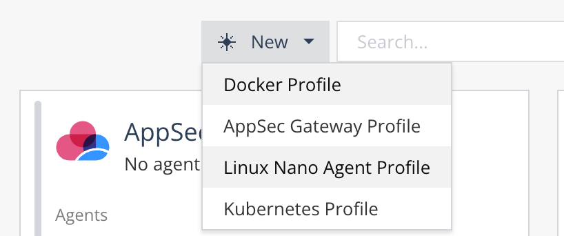
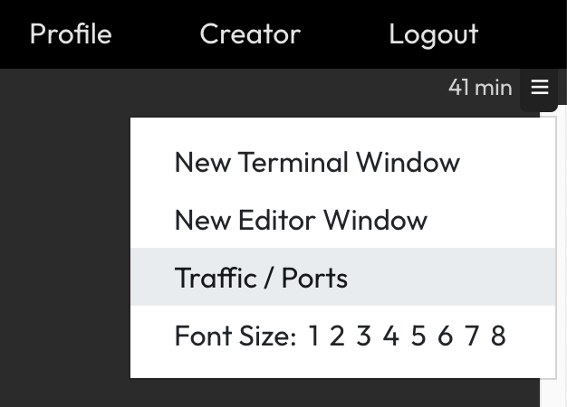
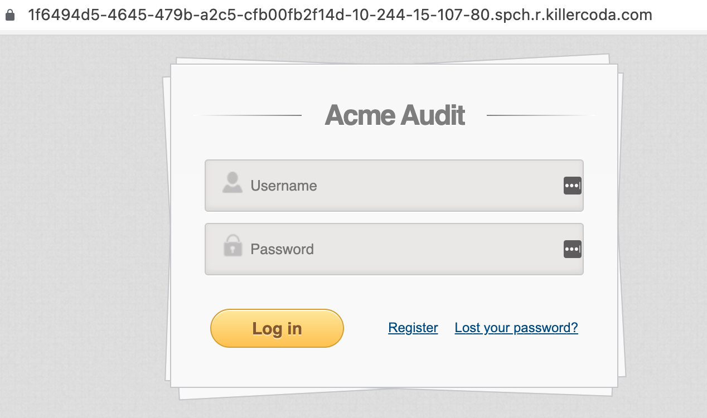
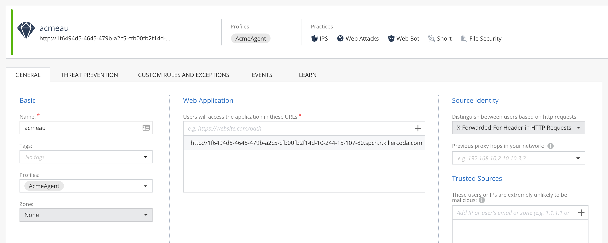

# AppSec - Linux Nano Agent Profile

AppSec in *Linux Nano Agent Profile* means that existing [supported platform](https://portal.checkpoint.com/dashboard/policy#/support/release-notes/supported-versions/) (Linux distribution and NGINX reverse proxy) that was installed and configured by customer's admin will be enhanced with security features by deployment of Check Point's Nano Agent with next-gen contextual AI-based WAPP feature set.



This example guides you starting from fresh Linux machine on-demand on [Killercoda](https://killercoda.com/playgrounds/scenario/ubuntu).

1. NGINX installation
```bash
apt install nginx -y
```

2. Lets deploy sample vulnerable application using Docker container
```bash
docker run -d -p 3030:3000 public.ecr.aws/f4q1i2m2/acmeaudit
```

3. Modify NGINX to become reverse proxy for ACME Audit application
```
vi /etc/nginx/conf.d/acme-audit.conf
```
and configure new how to pass traffic to real application
```
server {
   server_name _;
   location / { proxy_pass http://localhost:3030; }
}
```
And replace default site with empty configuration
```
mv /etc/nginx/sites-available/default /tmp/
touch /etc/nginx/sites-available/default
nginx -t
nginx -s reload
```

4. Test if application is reachable. Login form HTML is expected.
```
curl localhost
```

5. Application is also reachable from browser using top-right menu of Killercoda terminal and Traffic / Ports menu. 

Check port 80.


6. Lets proceed to AppSec Nano Agent installation with new Profile creation (Linux Nano Agent Profile)

Create Linux Nano Agent profile named *AcmeAgent* and push policy with Enforce button.

Copy Nano Agent installation command to Killercoda console:
```
wget https://checkpoint.com/nanoegg -O nanoegg && chmod +x nanoegg && ./nanoegg --install --token cp-db1f1c21-this-is-your-real-token
```

7. Monitor Nano Agent installation progress and policy version with
```
watch -d cpnano -s
```

8. Asset describes protected application

Define asset for Acme Audit as following and assign it to AcmeAgent profile.
Front-end URL is URL that you know from your browser,
but make sure to change HTTPS to HTTP as Killercoda is approaching
your NGINX on HTTP protocol even if your browser to Killercoda is HTTPS.




